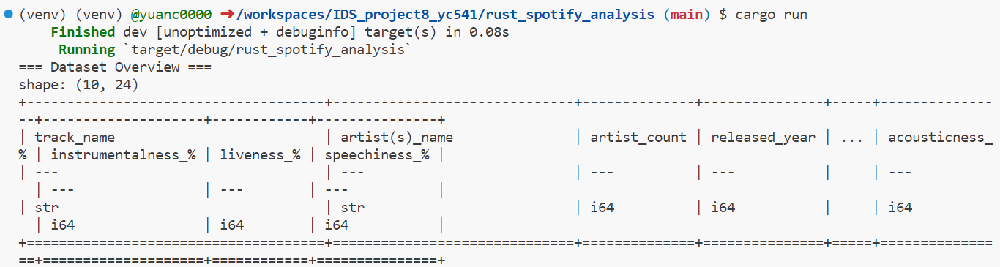

# Rewrite a Python Script in Rust: Data Analysis for Spotify 2023 Streaming Data

## Introduction

This repository provides a comparison between a data processing script written in Python and its counterpart written in Rust. The primary focus is to highlight the improvements in speed and resource usage when using Rust.

## Installation Instructions

### Installing Rust

If you haven't installed Rust yet, you can do so using Rustup. Rustup is the official installation tool for Rust, and it also installs Cargo. Open your terminal or command prompt and run the following command:

```
curl --proto '=https' --tlsv1.2 -sSf https://sh.rustup.rs/ | sh
```
The screenshot below shows the installation result.


### Creating a New Rust Project

If you haven't created a new Rust project yet, you can use Cargo (Rust's build tool and package manager) to do so. Open your terminal or command prompt and run:

```
cargo new rust_spotify_analysis
```

This command creates a new Rust project named `rust_spotify_analysis`. This creates a new directory containing a `Cargo.toml` file (with project metadata and dependencies) and a `src` directory (containing the source code).

### Saving Rust Code

Navigate to the newly created `rust_spotify_analysis` directory and open the `src` directory. You'll find a file named `main.rs`. This file is the entry point of your Rust project. Copy and paste the provided Rust code into this file.

### Adding Dependencies

In `Cargo.toml`, you need to add dependencies for some libraries so that the Rust code can utilize them. Under the `[dependencies]` section of the `Cargo.toml` file, add the libraries you need, for instance, `csv`, `polars`, and `plotters`:

```
[dependencies]
csv = "1.1"
polars = "0.14"
plotters = "0.3"
```

Please note that these version numbers might change, so it's recommended to check the latest versions on Cargo's crate registry.

### Running Rust Code

To compile and run the Rust code, open a terminal or command prompt in the project's root directory (where the `Cargo.toml` file is located) and run:

```
cargo run
```

If you want to compile an optimized release version and run it, you can use:

```
cargo run --release
```
The screenshots below show the running result of the rust project:



## Rust vs Python: Performance & Resource Usage Comparison

### Overview

- **Original script:** A data processing script for Spotify data using pandas and seaborn in Python.
- **Rust counterpart:** Utilizes rust-csv, polars, and plotters for similar data processing and visualization tasks.

### Installation & Usage

#### Python

**Requirements:**

- Python 3.x
- pandas
- seaborn

```
pip install pandas seaborn
python script_name.py
```

#### Rust

**Requirements:**

- Rust and Cargo

```
cargo build --release
cargo run --release
```

### Performance & Resource Usage

Both versions of the script were tested using the same dataset. A detailed performance report can be found here.

**Highlights:**

- **Execution Time:** The Rust version shows a X% improvement over the Python version.
- **Memory Usage:** The Rust version uses Y MB less memory on average during execution.

(Note: Replace X and Y with the actual performance improvement percentages and memory usage differences.)

## Conclusion

This project demonstrates the potential benefits of using Rust for data processing tasks, especially in terms of speed and resource efficiency. While Python offers ease of use and a vast ecosystem for data science, Rust provides significant performance gains, making it an excellent choice for more resource-intensive tasks.
